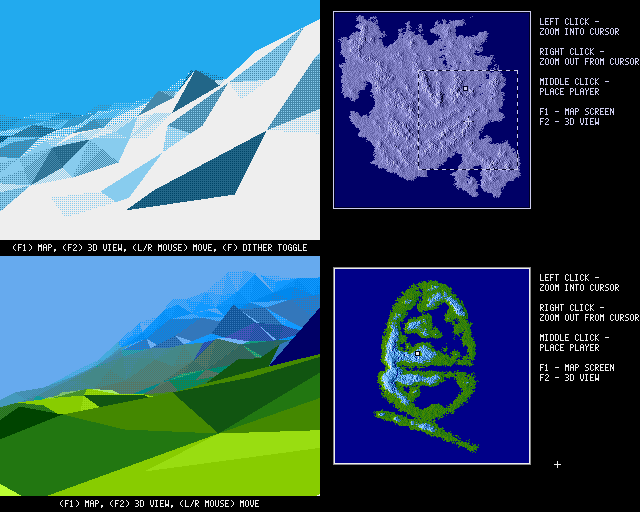

# Snowscape

### Description
A 3D landscape engine for Acorn Archimedes based on the [Midwinter](https://en.wikipedia.org/wiki/Midwinter_(video_game)) series of games by Mike Singleton and Maelstrom. These games were never released for Acorn machines, so Snowscape explores what an authentic Archimedes version might have looked and felt like while taking advantage of the machine's ARM processor and distinctive 256-colour palette. It is written in C89 and ARM assembly and uses the [C89 dynamic array](https://github.com/eteran/c-vector) by Evan Teran.

The DOS version of *Midwinter* has now been fully reverse engineered elsewhere. Snowscape uses the resulting documentation to reproduce the original terrain generation, world behaviour, rendering decisions, palette character, fog, and overall experience as closely as practical. But this is not intended to be an instruction-for-instruction port of the original x86 code by any means. Where appropriate, routines and data flow are redesigned for ARM and RISC OS&mdash;including fixed-point maths, lookup tables, polygon rasterisation, screen banking, and machine-specific draw distances&mdash;to keep performance as high and predictable as possible on real Archimedes hardware. Fidelity describes the result; the implementation remains purpose-built for Acorn machines.

As the Archimedes has a 'quirky' 256 color mode, I've implemented a 256 color version. However, there's also a Mode 9 16-color version which aims to look closer to the Atari ST and Amiga originals. Also there's an A5000 version with further draw distance.

The original game used a big-endian ZBUFFER.BIN on PC (taken from the Amiga/ST version) with a starting grid of 50x50 points and a hash table for midpoint generation. A custom version of this has been created as to not ship copyrighted code, but if you legally own Midwinter on PC, you can rename that file ZBUFFER and replace the one in the assets folder to see the original Midwinter isle.

As per the license this software is released **AS IS**. I don't have the time to look through pull requests, etc., but please feel free to fork the project and play with it as you will. :)

Click on the image for a YouTube recording in Arculator\

### QuickStart and Controls
Thanks to the amazing [Archimedes Live!](https://archi.medes.live/) you can run a prebuilt version directly in the browser.

[SnowScape A5000 Version](https://archi.medes.live#preset=a5000&ff=14400&disc=https://raw.githubusercontent.com/arkiruthis/snowscape/25f89f3b0dee86dc6675f090872a5919808afcab/Images/snowscapeA5000.adf&autoboot=desktop%20filer_run%20adfs::0.$.!Snowscape) (further draw distance)\
[SnowScape A3020 Version](https://archi.medes.live#preset=a3020&ff=14400&disc=https://raw.githubusercontent.com/arkiruthis/snowscape/25f89f3b0dee86dc6675f090872a5919808afcab/Images/snowscapeA3020.adf&autoboot=desktop%20filer_run%20adfs::0.$.!Snowscape) 

#### Controls
MAP LEFT CLICK - Zoom in around the selected point\
MAP RIGHT CLICK - Zoom out\
MAP MIDDLE CLICK - Set the player location\
F1 - Map screen\
F2 - Enter the 3D world at the selected player location\
LEFT CLICK - Move forwards\
RIGHT CLICK - Move backwards\
MOUSE - Move view\
ESCAPE - Return to RISCOS

### Known Issues
- When you reach the edge of the terrain, you'll be abruptly reset to the starting position. TODO - like the original Midwinter, we could reset the camera and generate the terrain to match the next section you're in. 
- Performance could probably be improved by moving more C into ARM assembly... but it's worth playing the original Midwinter on a stock STFM or A500 as a reminder of the original framerate... 😜 
- Why is there a blue line at the bottom? Because when I draw there I get a stack heap corruption on exit. 😱 It'll be something trivial, it always is... 
- Needs a 4MB setup. Could probably be fixed to run on 2MB machines.

### Building Prerequisites
Either of the following GCC cross-compiler build systems can be used to create the RISCOS binary. Both can be built and used using Linux, WSL in Windows, and Docker with Ubuntu in MacOS (ArchieSDK has a MacOS-native build now).
- [GCCSDK](https://www.stevefryatt.org.uk/risc-os/build-tools/environment) - An older GCC 4 build SDK commonly used for RISCOS Open development
- [ArchieSDK](https://gitlab.com/_targz/archiesdk) - A more recent GCC 8 build by Tara Colin and various contributors, particularly of interest to the Acorn demoscene.

### Building
1. Open `build.sh` and ensure the output directory matches where you'd like the resultant App to go. (probably your Arculator hostfs folder)
2. Choose the toolchain you want `GCCSDK` or `ARCHIESDK`.
3. Choose 256 color and/or A5000 mode. The A5000 mode has a further draw distance and will perform much slower on A30X0 machines.
4. Run `build.sh` - if no errors, it should have copied the `!Snowscape` app to your hostfs and you can double-click the App to start it

### Running on Original Hardware
Use an emulator (Arculator, RPCEmu, ArchiEmu, etc.) to copy the Projects folder onto an ADF and either use that in a Gotek, or use it to prepare a floppy disk. This is to preserve the file types that are set up on HostFS so that they run correctly on native RISCOS. 

### Enabling Profiling
1. Uncomment `// #define TIMING_LOG 1` in `/Projects/h/Render`
2. Uncomment `| Run <Obey$Dir>.TimerMod` in the `/Projects/!Run` script.
3. Download [TimerMod](https://armclub.org.uk/free/) and unpack into in the `/Projects` folder.
4. Rebuild and Run.

### Scripts
- The scripts folder contains a NodeJS script which is used to take the exported Archimedes palette (a list of RGB hex numbers) and generate a lookup table. It does this as a PNG first, because of the limited options, it doesn't always get the gradients looking nice, so we can tweak the table a bit before turning it into the binary lookup which is used by the engine in the /assets folder. 

### Grateful Thanks and Shoutouts
The Maelstrom team (particularly in memory of [Mike Singleton](https://en.wikipedia.org/wiki/Mike_Singleton)), whos incredible games made a little me believe whole worlds could exist in a small home computer!

David Ruck for his superb [TimerMod](https://armclub.org.uk/free/) utility which is available from his site which made profiling many of the routines far easier.

The amazing [Bitshifters](https://bitshifters.github.io/index.html) team for always being generous with their knowledge and pushing the Archimedes and BBC Micro to it's limits with their amazing demos!

[Tara Colin](https://gitlab.com/_targz/archiesdk), and others who have contributed to the ArchieSDK tools which has opened up an exciting new chapter in demoscene development for early RISCOS machines. 

Tom Sneddon for helping me fix the CORS issue which means we can link to Archimedes Live! direct from here. Also check out `b2`, his amazing [BBC Micro Emulator](https://github.com/tom-seddon/b2)! 
